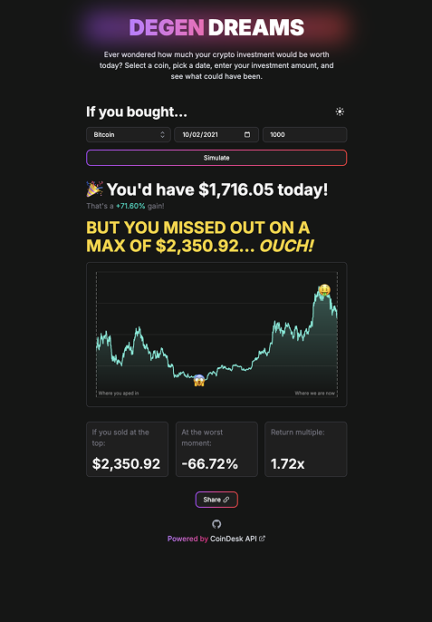
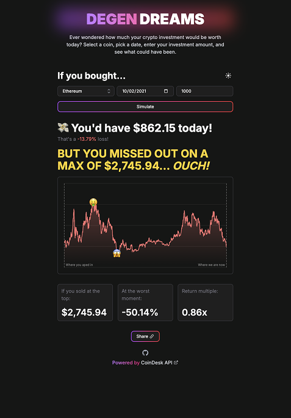

# Degen Dreams

A web application that lets you calculate potential returns on cryptocurrency investments. Ever wondered how much your crypto investment would be worth today? Select a coin, pick a date, enter your investment amount, and see what could have been.

## Live Demo

Try the application live at: [https://degen-dreams.vercel.app/](https://degen-dreams.vercel.app/)




## Features

- Calculate potential returns on cryptocurrency investments
- View detailed statistics including:
  - Current value
  - Profit/loss percentage
  - Maximum value achieved
  - Highest and lowest points
- Share your results with others
- Dark/Light theme support
- Mobile-responsive design

## Tech Stack

- Next.js
- TypeScript
- Tailwind CSS
- React Query
- Turborepo (monorepo setup)

## Project Structure

```
degen-dreams/
├── apps/
│   └── web/                 # Main web application
│       ├── app/            # Next.js app directory
│       │   ├── api/        # API routes
│       │   ├── components/ # React components
│       │   ├── data/       # Static data
│       │   ├── services/   # Service layer
│       │   └── theme/      # Theme configuration
│       └── ...
├── packages/               # Shared packages
│   ├── ui/                # Shared UI components library
│   │   ├── src/
│   │   │   ├── components/ # Reusable React components
│   │   │   ├── styles/    # Shared styles and themes
│   │   │   ├── utils/     # Utility functions
│   │   │   └── test/      # Component tests
│   │   └── dist/         # Built package output
│   │
│   ├── eslint-config/    # Shared ESLint configurations
│   │   ├── base.js      # Base ESLint rules
│   │   ├── next.js      # Next.js specific rules
│   │   └── react-internal.js # React specific rules
│   │
│   └── typescript-config/ # Shared TypeScript configurations
│       ├── base.json    # Base TypeScript config
│       ├── nextjs.json  # Next.js specific config
│       └── react-library.json # React library config
└── ...
```

## Getting Started

1. Clone the repository
2. Install dependencies:

   ```bash
   npm install
   ```

3. Start the development server:

   ```bash
   npm run dev
   ```

4. Open [http://localhost:3000](http://localhost:3000) in your browser

## Development

The project uses Turborepo for monorepo management. The main application is in the `apps/web` directory.

### Testing

The project uses a comprehensive testing setup with the following tools:

- **Vitest**: Fast and modern test runner
- **React Testing Library**: For component testing
- **MSW (Mock Service Worker)**: For API mocking

#### Running Tests

```bash
# Run all tests
npm run test

# Run tests in watch mode
npm run test:watch

# Generate test coverage report
npm run test:coverage
```

The test setup includes:

- JSDOM environment for browser-like testing
- API mocking with MSW
- Coverage reporting with V8
- Integration with Next.js navigation

Tests are organized in the following structure:

### CryptoCompare API Integration

The application uses the CryptoCompare API to fetch historical cryptocurrency price data. Here's how it works:

1. **Data Fetching**:

   - Uses the `/v2/histoday` endpoint to get daily OHLCV (Open, High, Low, Close, Volume) data
   - Supports over 100 cryptocurrencies including major coins, DeFi tokens, and gaming/metaverse tokens
   - Data is cached until the next UTC day to optimize API usage

2. **Price Calculations**:

   - Calculates investment returns based on historical price data
   - Determines key metrics:
     - Current value of investment
     - Profit/loss percentage
     - Maximum value achieved
     - Highest and lowest points
     - Return multiple

3. **API Features**:

   - Automatic currency conversion (e.g., BTC to USD)
   - Historical data from the selected date to present
   - Error handling for invalid dates or unavailable data
   - Caching to optimize API usage

4. **Data Visualization**:
   - Interactive price charts using Recharts
   - Visual indicators for entry point, current value, and highest/lowest points
   - Color-coded charts based on profit/loss status

## License

This project is licensed under the MIT License - see the LICENSE file for details.
